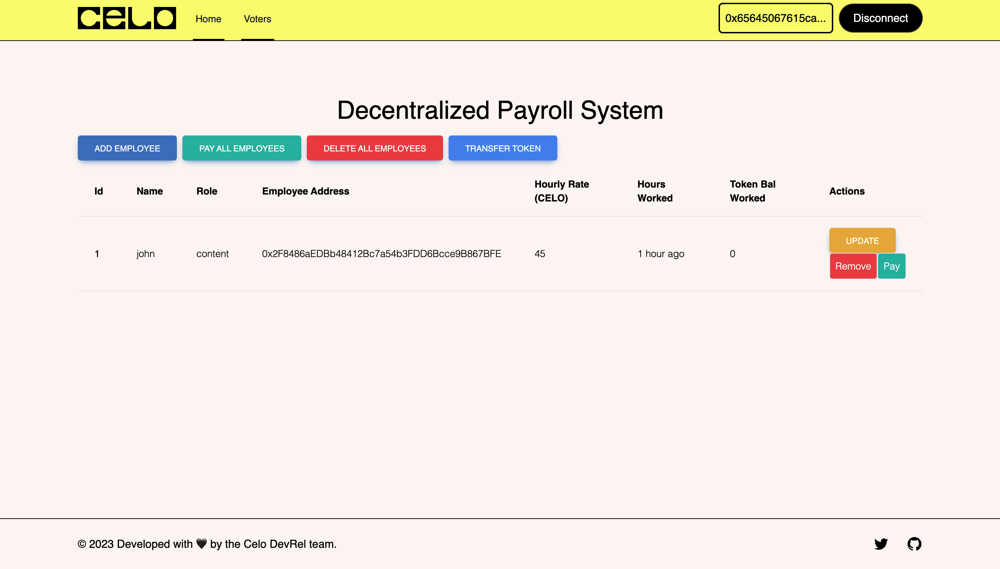

# Decentralized Payroll Dapp with Celo Composer
The Payroll dApp was built using Celo Composer. 

The contract contains for the following
  - Add employee
  - Get list of employees
  - Update Employee hourly rate
  - Remove Employee
  - Pay all employees based on hours worked
  - Pay employee based on hours worked

## Demo

This screen shows the different actions that can be carried on with the dapp

